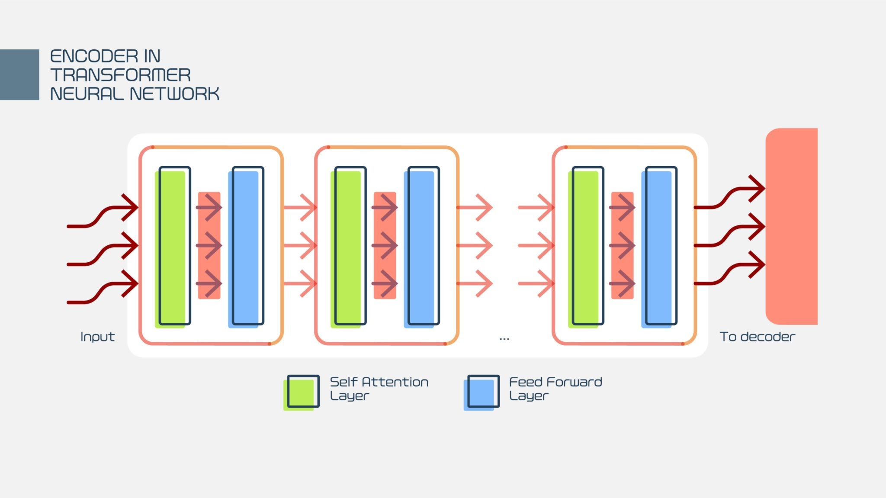

# **Breve Introdução ao Processamento de Linguagem  Natural**

---

O `Processamento de Linguagem Natural`, ou NLP (do inglês, _Natural Language Processing_), é uma subárea da **Inteligência Artificial** que estuda formas de desenvolver capacidades para máquinas entender, interpretar e gerar linguagem humana, tanto escrita quanto falada. Combinando várias aŕeas do conhecimento, como — linguística, aprendizado de máquina e a IA para analisar dados textuais não estruturados. 

 

## 1. **Evolução Histórica e COntextualização**

A evolução do _NLP_ pode ser dividida em quatro paradigmas principais:

 - 1.1. **Simbólico (1950s - 1990s)**: Baseado em regras gramaticais rígidas e léxicos feitos à mão. O foco erra em análise sintática e lógica formal (ex.: `Teste de Turing`, `ELIZA`).

 - 1.2. **Eststístico (1990s - 2010s)**: Introdução de modelos probabilísticos como `Cadeia de Markov Ocultas` (HMM) e `N-grams`. A tradução passou a ser baseada em frequências de _corpora_ textuais.

 - 1.3. **A Era dos Transformers e LLMs (2017s - Presente)**: A introdução da arquitetura `Transformer` e do mecanismo de **Atenção¹** permitiu o treinamento em larga escala, levando a modelos como `Bert`, `GPT` e `T5`, que dominam o estado da arte atual.

 

 > [1] O mecanismo de atenção em `Transformers` é o "coração" da arquitetura, introduzido no artigo chamado, `"Attention Is All You Need"` de (2017). Ele permite que o modelo processe dados sequenciais (como texto, imagens ou áudio) focando seletivamente em partes relevantes, simulando a capacidade cognitiva humana de ignorar detalhes irrelevantes e focar no contexto.

E diante do exposto acima, iremos estudar as aplicações do _NLP_, desde arquiteturas mais simples até a principal em voga - `Self-Attention` e seus principais componentes. Lembrando que tudo será uma simples introdução e não um aprofundamento teórico.

---

## 2. **Plano de Estudos**

- **Módulo I**: Fundamentos e Pré-processamento
    - Teoria: Linguística Computacional (Morfologia, Sintaxe, Semântica e Pragmática).
    - Prática: Tokenização, Stemming/Lematização, Stop words e Part-of-Speech (PoS) Tagging.

- **Módulo II**: Representação Vetorial (Embeddings)
    - Técnicas Clássicas: TF-IDF e Bag-of-Words (BoW).
    - Deep Learning Inicial: Word2Vec (Skip-gram e CBOW), GloVe e FastText.

- **Módulo III**: Arquiteturas de Sequência
    - Modelos Recorrentes: RNNs, LSTMs (Long Short-Term Memory) e GRUs.
    - Mecanismos de Encoder-Decoder: Tradução automática e Seq2Seq.

- **Módulo IV**: A Revolução dos Transformers
    - Mecanismo de Atenção: Self-attention e Multi-head attention.
    - Modelos Pré-treinados: BERT (Encoder-only), GPT (Decoder-only) e T5 (Encoder-Decoder).
    - Fine-tuning: Ajuste de modelos gigantes para tarefas específicas.

- **Módulo V**: MLOps para NLP
    - Deployment: Servir modelos via APIs (FastAPI/Docker).
    - Monitoramento: Drift de dados textuais e métricas de performance (BLEU, ROUGE, F1-Score).

---

## 3. **Técnicas Principais**

- NER (Named Entity Recognition): Identificação de entidades como nomes, datas e locais.

- Análise de Sentimento: Classificação de textos em polaridades (positivo, negativo, neutro).

- Sumarização: Redução de textos mantendo o núcleo informativo (Extrativa vs Abstrativa).

- RAG (Retrieval-Augmented Generation): Técnica que combina recuperação de documentos externos com modelos de linguagem para reduzir alucinações.
